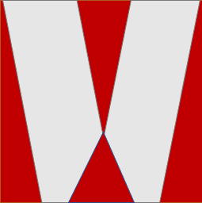
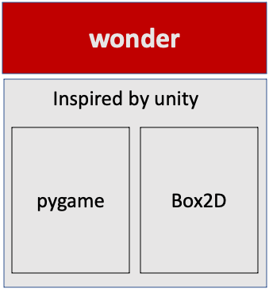
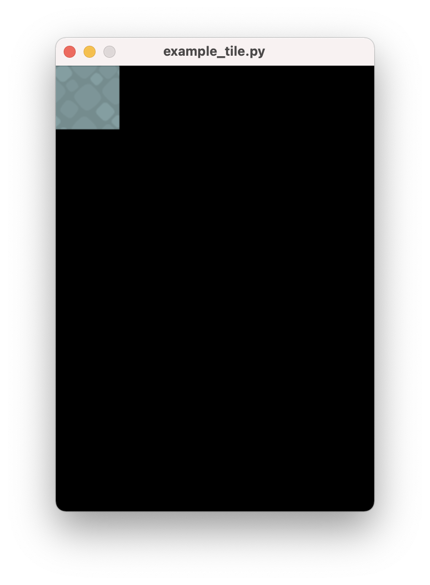
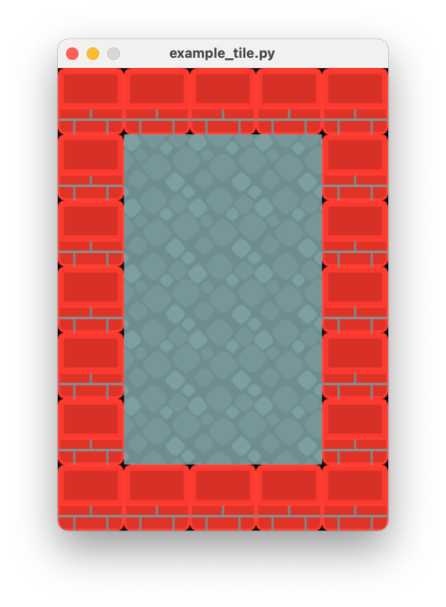
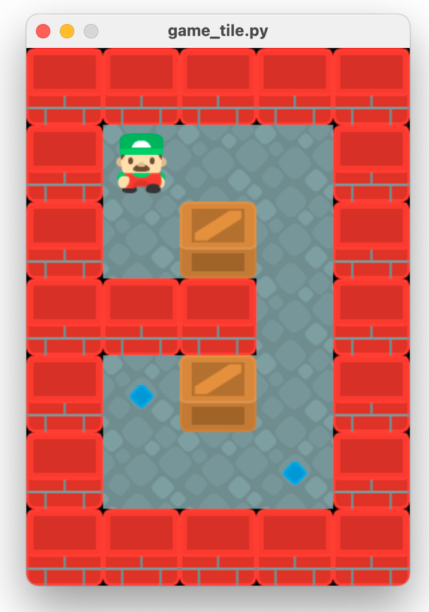

# wonder - Python Game Engine

## Whenever I have played a great computer game for the first time, <br>I was **wonder**ing how they do it. Then I tried to recreate it.

<br><br><br><br><br><br>

**Pygame** (https://www.pygame.org) is a great library for making your own game with python. 

When starting a new game from scratch you always need to build the basic structure. The game engine `wonder` gives you a collection of components you can use with **Pygame**.

The game engine `wonder` is only a frame for your programming, so you have to know Pygame for creating new games.

Many ideas in `wonder` are inspired by *Unity 3D* (https://unity.com)

If you are looking for more simple to use Pygame frameworks:

* **pygame zero** https://github.com/lordmauve/pgzero
* **python arcade library** https://arcade.academy

The game engine `wonder` includes Box2D as physics engine.

Goals:
   
* explicit is better then implicit - wonder is only the frame for your game
* Component based - more components, less classes
* Inspired by Unity 3D
* Physics engine included


<br><br><br><br><br><br>


If you like it, use it. If you have some suggestions, tell me (hebi@ninja-python.com).

All game assets that I use in examples are free and from https://www.kenney.nl. Thank you.

## acclaimer

You can use this alpha version 0.1.0 of the game engine `wonder` but there will be some changes in the future.

## installing wonder game engine

Install with pip


```python
pip install wonder
```

If that does not work on your platform you can install the different components separately

Install **pygame**


```python
pip install pygame
```

Install physics engine **Box2D**


```python
pip install box2d
```

For installing **wonder** simply copy file **wonder.py** to your directory.


```python
cp wonder.py
```

## wonder game engine - making a new game 

### main game


```python

```

### level 1 - scene

A scene contains of gameobject

create  

add gameobject

### gameobject

first gameobject Racket   
add SpriteRender Component  
fixed_rotation


```python

```

### create border

component rigidbody static


```python

```

### create blocks

#### move racket

#### debug

### create ball

restitution   
component rigidbody  
component circlecollider

#### move ball


```python

```

### create block

component rigidbody  
component boxcollider

### create scoremanager

get_object   
start_tag  
draw_text 

### restrart

#### 0 ball level 1

### next level

## wonder game engine -  behind the curtain

### central engine and the systems


```python

```

#### pattern singleton


```python

```

#### game loop update draw

event  
update  
late_update  
draw  

#### timing


```python

```

#### event system

on_load_scene

observer pattern

#### get_object

#### GetObject

### gameobject

#### mixin


```python

```

#### transform


```python

```

#### components

SpriteRenderer

## scene

### layered container for gameobject


```python

```

### render system

layered observer

#### Component SpriteRenderer

Surface  
load_from_file

consists of surface and rect

### change current scene

#### add or remove gameobject

#### add or remove component


```python

```

## physic and collision system

using Box2D https://box2d.org/documentation/md__d_1__git_hub_box2d_docs_dynamics.html  
python https://github.com/pybox2d/pybox2d

### bodies

Component Rigidbody is b2Body

#### synchornize transform


```python

```

#### body types

STATIC_BODY  
    physic system does not simulate this body  
    body has zero velocity  
    body does not collide with other static or kinematic bodies  

KINEMATIC_BODY  
    physic system simulates this body  
    body does not respond to forces  
    program can move body normally by setting velocity  
    body does not collide with other static or kinematic bodies  

DYNAMIC_BODY  
    physic system simulates this body  
    body collides with other bodies  

#### fixtures

component collider is b2Fixture

boxcollider

#### debug

### joints

#### distance joints

get_gameobject

## animator component

animator has states  
state has clips


```python

```

## particle system


```python

```

## tile system

A **TileMap** is an GameObject and consists of *width* x *height* tiles.  
Every tile has a width of *tile_width* pixels and a height of *tile_height*. 


```python
GRID_WIDTH = 5
GRID_HEIGHT = 7

CELL_WIDTH = 64
CELL_HEIGHT = 64

tilemap = TileMap(GRID_WIDTH,GRID_HEIGHT,CELL_WIDTH,CELL_HEIGHT)
```

The tilemap.transform.position is always the top left position of the map. With changing position you can move the complete map.

A TileMap has a **palette** with different **TilePaletteItem** you can use in a tilemap.  
A **TilePaletteItem** has an unique **id**, an unique **tile_type** and an **image**.


```python
tilemap.palette.add(TilePaletteItem(0, tile_type='ground', image=pygame.image.load('res_tile/ground.png')))
tilemap.palette.add(TilePaletteItem(1, tile_type='wall', image=pygame.image.load('res_tile/wall.png')))
..
```

To create a tile from the palette at a specific position in the tile map use the function **create_tile_from_palette**(*position_x*,*position_y*,*tile_type* or *id*)


```python
tilemap.create_tile_from_palette(0,0,'ground')
```

<br><br><br><br><br><br>

You can create a complete tile map with **set_all_tiles** 


```python
tilemap.set_all_tiles([[1,1,1,1,1],
                       [1,0,0,0,1],
                       [1,0,0,0,1],
                       [1,0,0,0,1],
                       [1,0,0,0,1],
                       [1,0,0,0,1],
                       [1,1,1,1,1]])
```

<br><br><br><br><br><br>

A class **TileMap** can have more than one layer of tiles. Negative values are None.


```python
new_layer = tilemap.add_layer()

tilemap.set_all_tiles([[-1,-1,-1,-1,-1],
                       [-1, 4,-1,-1,-1],
                      ..
                       [-1,-1,-1, 2,-1],
                       [-1,-1,-1,-1,-1]],tile_layer=new_layer)
```

<br><br><br><br><br><br>

To see something tilemap as gameobject needs rendering component


```python
tilemap.add(TileMapRenderer(tilemap))
```

With class **TileController** a tile can react


```python
tilemap.palette.add(TilePaletteItem(4, tile_type='player', image=pygame.image.load('res_tile/player_01.png'),
                                    tile_controller_class=Player))
```

Class **Player** is in gameloop update cycle


```python
class Player(TileController):
    def __init__(self,tile:Tile):
        super().__init__(tile)
        ..
        
    def update(self, delta_time: float):
        ..
```

Class **TileController** has some convinient methods.

`get_position()` .. current tile position  
`tile = self.get_tile(pos)` .. get tile at postion  
`tile.has_type('ground')` .. has tile the that type  
`set_position(new_pos)`.. change position of tile  


```python

```

## Changelog

|Version       |                                                                                          |
|--------------|------------------------------------------------------------------------------------------|
|  0.1.0       | first version |


```python

```
